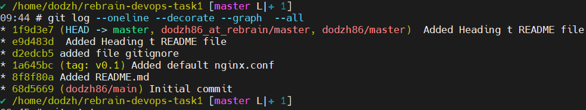

# Репозиторий rebrain-devops-task1

Добро пожаловать в репозиторий для задания 4 курса "DevOps практики и инструменты" от Rebrain University.

## Описание

Этот репозиторий создан для выполнения и предоставления задания 4, связанного с освоением основных понятий и инструментов DevOps.

## Задачи

В рамках этого задания мы будем:

1. Изучать основы Git и GitHub:
   - Создание репозитория
   - Клонирование репозитория
   - Добавление и коммит изменений
   - Отправка изменений на удалённый репозиторий

2. Работать с Markdown:
   - Создание структурированного файла README.md
   - Использование различных методов форматирования текста:
     - **Выделение жирным**
     - *Выделение курсивом*
     - `Вставка кода`

3. Применять на практике понятия DevOps:
   - Автоматизация сборки и развёртывания

## Полезные ресурсы

Для успешного выполнения задания полезно ознакомиться с следующими материалами:
- [Документация по Git](https://git-scm.com/doc)
- [GitHub Guides](https://guides.github.com/)
- [Гайд по Markdown](https://guides.github.com/features/mastering-markdown/)

## Скриншот

Пример визуализации вывода log:



## Таблица

| Задание | Описание               |
|---------|------------------------|
| 1       | Создание репозитория   |
| 2       | Клонирование репозитория|
| 3       | Добавление изменений   |
| 4       | Отправка изменений     |

## Пример кода

```bash
git clone https://gitlab.rebrainme.com/devops_users_repos/5248/rebrain-devops-task1.git
cd rebrain-devops-task1
touch nginx.conf
git add nginx.conf
git commit -m "Added nginx.conf file"
git push dodzh86_at_rebrain

